CPCB's user interface
=====================

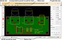

CPCB comprises several toolbars arranged
around the PCB being edited. These toolbars are:

  *Mode bar*
    CPCB makes heavy use of “editing modes.” At any time, CPCB is in
    one of several modes, and a toolbar on the left of the main window
    is used to switch between modes and to indicate the current mode.

  *Properties bar*
    A toolbar on the right shows the various editable properties of
    selected objects or objects to be placed.

  *Status bar*
    A small  bar at the bottom of the window shows cursor
    position, grid settings, and which features are currently being shown.

  *Menu bar*    
    Along the top of the window a standard menu bar is shown.

Two other panels are not shown by default but may be opened through the “View” menu:

  *Components panel*

    Opened automatically when CPCB is used to edit a PCB design that
    is linked to a CSchem schematic, this shows all the not-yet-placed
    components. You can drag component footprints in from a Filer
    window [#f1]_ into this panel, or from this panel onto the main
    PCB.

  *Bill of materials (BOM)*

    This panel can be used to associate part numbers and catalog
    numbers with components in the layout.

Editing modes
-------------

CPCB uses different “modes” for placing, moving, and modifying holes,
traces, and other objects. Because changing modes is such a frequent
task, keyboard shortcuts are available for each of the modes. The
modes are (from top to bottom in the “mode bar”):

  |icon-mode-sel| *Selection mode (F1)*  

    This is a highly multifunctional mode:

    - Objects can be selected by
      clicking on them or dragging a rectangle over them.
    - Selected objects can be modified using the Properties bar.
    - Objects can be moved by dragging with the mouse.
    - Objects can be deleted or placed on a clipboard using
      standard cut-and-paste operations.
    - Selected objects can be grouped into a component
      (“Control”+“G”) and existing components can be ungrouped
      into separate objects (“Control”+“Shift”+“G”).

    In addition, double-clicking on different types of objects has
    specific effects in this mode:

    - Double-clicking on a group “enters” the group so its
      contents can be edited in-place. (Double-clicking on blank space
      “exits” a group that was entered in this way.)
    - Double-clicking on a pad or hole allows the name or number
      of that pad or hole to be changed [#f2]_.
    - Double-clicking on a piece of text allows the text to be
      edited.

  |icon-mode-trace| *Trace mode (F2)*

    In this mode, new traces are placed on the PCB by clicking with
    the mouse. The Properties bar can be used to determine the width
    of the traces as well as which layer they will be placed
    on. Traces can be placed on copper and silkscreen layers alike.

  |icon-mode-hole| *Plated hole mode (F3)*

    In this mode, mouse clicks place plated holes on the board. Holes
    always connect the top and bottom layers of the PCB. The
    Properties bar can be used to determine the hole diameter and the
    diameter of the surrounding pad. Holes can have either round or
    rectangular pads. This mode can also be used to create plated
    slots, by using the “Slot length” box in the Properties bar
    (below). Commonly, holes are part of components, in which case the
    “Pin” box in the Properties bar shows the pin name or number for
    the hole. This mode should not be used to create vias; see below.
      
  |icon-mode-pad| *Pad mode (F4)*

    In this mode, copper pads are placed on the PCB. Pads are
    generally used as part of surface-mount components, in which case
    the “Pin” box in the Properties bar shows the pin name or number
    for the pad.  Pads are normally placed only on copper layers, but
    CPCB doesn't stop you if you want to place a pad on the silkscreen
    layer.
  
  |icon-mode-text| *Text mode (F5)*

    In this mode, clicking on the board opens a small dialog window in
    which you type the text to be placed. Text is normally placed on
    the silkscreen layer, but may be placed on copper layers as well.
  
  |icon-mode-arc| *Arc mode (F6)*

    In this mode, circles or arcs are placed, typically on the
    silkscreen mode as part of component outline drawings.

  |icon-mode-plane| *Filled plane mode (F7)*

    Filled planes are filled areas on either copper layer. In filled
    plane mode, new planes can be created, existing planes can be
    edited, and holes and pads can be connected or disconnected from
    filled planes by double clicking. Use the Layer selector in the
    Properties bar (just above the Layer visibility toggles in the
    status bar) to determine the layer for a filled plane or filled
    plane connection. Working with filled planes is explained in more
    detail on :ref:`a separate page <cpcb-fp-label>`.
      
  |icon-mode-pickup| *Pickup mode (F8)*

    In this mode, clicking on an existing trace picks up that trace so
    that you can conveniently reconnect it to another point on the
    PCB.
     
  |icon-mode-nphole| *Nonplated hole mode (F9)*

    Nonplated holes are holes without copper plating. This mode can
    also be used to create straight milled slots by using the “Slot
    length” property.

  |icon-mode-pnp|  *PNP mode (F10)*

    In pick-and-place mode, you can mark up your layout to indicate
    the orientation of parts for assembly. This has no effect on the
    layout itself, but only on the “pick-and-place” files produced
    during Gerber export. Make the little blue triangles point in the
    direction that is “up” in the datasheet for your part, and PCB
    assemblers will likely get the hint. When in doubt, choose an
    assembler that provides a preview before committing to a
    purchase. That way, you can go back to your layout and correct any
    mistakes before they get cast into hardware.

The Mode bar contains one additional button that does not correspond to
an editing mode:

  |icon-mode-angle| *Angle constraint (F12)*

    Use this to toggle between placing traces with
    arbitrary angles and placing traces that are constrained to be
    either horizontal, vertical, or at 45° to the canonical
    axes.  

The Properties bar
------------------

The properties bar is used to specify properties for new items to be
placed on the board. In “Edit mode,” the properties bar reflects the
properties of currently selected items,
and can be used to modify those properties [#f3]_.

Many items in the Properties bar may speak for themselves, but
here is a list with a few notes. From top to bottom:

  *X*
    The x-coordinate of the selected object or objects. You can
    type in the box to move the selection to a new location.

    To the left of the box are an “Abs/Inc” toggle and an “Anchor”
    toggle:

    |icon-toggle-abs|
        The “Abs/Inc” toggle may be used to switch between absolute
        coordinates (from the left edge of the board) to “incremental”
        coordinates relative to a feature on the board.

    |icon-toggle-anchor|
        By default, the coordinates of the “principal point” of an
        object are shown and edited in the *X* box. For a hole or a pad,
        that is the center of that hole or pad, for text that is the left
        edge of the text, for a component that is the center of its
    lowest-numbered pin, etc. By clicking on the “Anchor” toggle, you
    can instead display and edit the left edge, geometric center, or
    right edge of a selection.
  
  *Y*
    The y-coordinate equivalent of previous item. When multiple
    objects are selected, the topmost y-coordinate is shown.

    The “Abs/Inc” and “Anchor” toggles for *Y* are independent of
    those for *X*.
  
  |icon-para-linewidth| *Line width*

    This item represents the width of traces and arcs.

  |icon-para-diameter| *Diameter*
  
    The diameter of (plated and nonplated) holes as well as arcs.
  
  |icon-para-slotlength| *Slot length*
  
    The extra length of a milled slot. (The full length of a slot is
    the stated “Slot length” plus the diameter.) Applies to both
    plated and nonplated holes.
    
  *OD*
  
    Outer diameter of the round pad surrounding a plated hole, or
    length of the square pad surrounding such a hole. If the hole is
    in fact a slot, the pad is expanded along with the hole.
  
  *Shape*
  
    Selects whether the pad surrounding a hole is round or
    square.
    
  *Width*
  
    The width of an SMT pad (along the x-axis).

  *Height*
  
     The height of an SMT pad (along the y-axis).

  *Ref.* or *Pin* or *Text*
  
    Multifunctional item that shows the “Reference” ID for a
    component; the “Pin number” for a hole or pad; or the contents of
    a text object.
    
  *Font size*
  
    Font size for text objects.

  |icon-para-arcstyle| *Arc style*
  
    Selector for different kinds of arcs.

Wherever dimensions appear in the Properties bar, simple arithmetic is
accepted. Thus you can type things like “0.3 in + 2*0.7 cm”. CPCB
understands “mm” and “cm” as metric units. It also understands
“in,” “inch”, and “"” (double quote) to mean inches. If
you leave out a unit, the units of the current grid determine how your
input is interpreted.

Rotating, flipping, and moving between layers
^^^^^^^^^^^^^^^^^^^^^^^^^^^^^^^^^^^^^^^^^^^^^

|icon-action-rotate| |icon-para-orient| At the very bottom of the
Properties bar, there are two more rows of buttons: The first allows
rotating and flipping of selected objects in Select mode. It doubles
to determine the orientation of newly created objects in Text and Arc
modes. The second row determines on what layer newly created objects
appear and can also be used to move objects between layers.

Creating vias
~~~~~~~~~~~~~

At present, the only way to create a via (a plated hole that is
covered by solder mask instead of being exposed and tinned) is to move
one segment of a multi-segment trace from the top layer to the bottom
or vice versa. Vias are represented as red-green dappled plated
holes. The initial size of newly created vias is algorithmically
determined by the width of the trace, but may be adjusted using the
Properties bar. Vias can, of course, be copied and pasted like any
other object.

The Status bar
--------------

The status bar displays the coordinates of the cursor and shows the
identity of holes, pads, and components that you hover over. It is
also home to a popup menu for selecting grid spacing. (Several common
choices prepopulate the menu, and you can define your own custom grid
spacing in either inches or millimeters simply by typing in any line.)

A group of icons on the right of the Status bar serves as indicators
and toggles for visibility of (from left to right): the silkscreen
layer; the top copper layer; the bottom copper layer; filled planes;
and nets.  The last two deserve further explanation:

- Filled planes may be placed on either top or bottom copper
  layers. They are only visible when both the layer on which they
  occur is visible, and the “filled planes visibility” toggle is on.

- “Nets” are collections of traces, holes, and pads that are
  electrically connected. When nets are visible, these collections are
  highlighted when the mouse hovers over any of their
  members. Additionally, if your PCB design is linked to a CSchem
  schematic, holes or pads that should be part of a net (but
  aren't yet) are highlighted in blue, and holes or pads that should
  not be part of a net (but are) are highlighted in pink. The message
  area on the left of the status bar may also show pertinent
  information about nets.

Components panel
----------------

When a PCB layout is linked to a CSchem schematic, one additional user
interface component is shown alongside the PCB: A list of all the
components of the schematic that have not yet been placed on the
PCB. The function of this panel is explained under :ref:`comppanel`.

 
Footnotes
---------

.. [#f1] E.g., “Gnome Files” in Linux, the “Finder”
        in Mac OS, or the “File Explorer” in Windows.

.. [#f2] When a pad or hole
        is part of a component that is linked to an element on a
        CSchem schematic, a combobox with predefined choices appears;
        otherwise, a free-form name editor appears.

.. [#f3] When multiple items
  are selected and they have conflicting property values, the
  properties bar will show “–––” instead of an actual
  value. Even in that case, typing in a new value overrides the
  properties of all applicable selected objects.
  

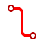
                                  

                                  

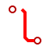
                                  
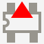
                                                                    
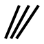
                                                                    
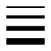
                                                                    
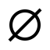
                                                                    

                                                                    
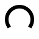
                                                                    
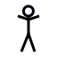
                                                                    
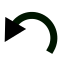
                                                                    

                                                                    
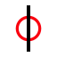
                                                                    
