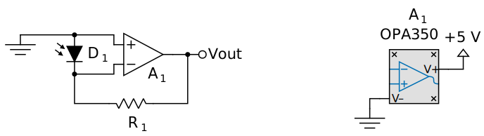
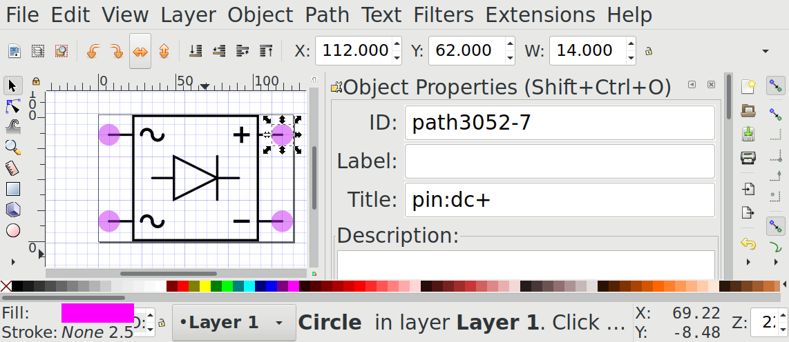
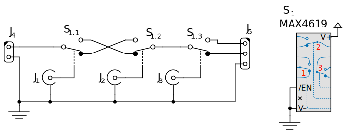

Advanced topics in CSchem
=========================

Parts list
----------

To open a parts list as a side panel, use the “View” menu or press
“Control”+“Shift”+“L”. The parts list can be used to
conveniently modify the “reference” and “part/value” text
associated with different elements, and allows you to add arbitrary
notes to any elements. (Those notes are not displayed on the canvas.)

More about elements
-------------------

It is conceptually useful to distinguish between several kinds of
elements:

  *Ports*:
    These are nonphysical entities such as a ground
    reference or markers to give names to signal traces. For instance:

      .. image:: ug-ground.svg
                 :scale: 70%

  *Parts*:
    These are mostly straightforward physical entities
    such as resistors, transistors, and connectors, or this battery:

      .. image:: ug-battery.svg
                 :scale: 70%

    but also more complex entities like logic gates, or this opamp:

      .. image:: ug-opamp.svg
                 :scale: 70%

  *Containers*:
    These are the physical devices that contain
    one or more logic gates or opamps. For instance this container for
    two opamps:

      .. image:: ug-cont.svg
                 :scale: 70%

Virtual parts and containers
^^^^^^^^^^^^^^^^^^^^^^^^^^^^

Ports and simple parts are straightforward enough. Virtual parts (such
as the opamp shown above) and containers may need some explanation.

Imagine this simple amplifier circuit for a photodiode:

  .. image:: ug-pdamp.svg
             :scale: 70%
             :align: center

In this circuit, *V*:sub:`out` is related to the photocurrent
*I*:sub:`D` by *V*:sub:`out` = *R*:sub:`1` × *I*:sub:`D`. (To see
this, consider that light hitting a photodiode induces a photocurrent
to run from the cathode to the anode, i.e., in the reverse direction
of the normal diode current. Because the opamp *A*:sub:`1` has
near-infinite input impedance, that current can only run through
*R*:sub:`1`, which must therefore (Ohm's law) develop a voltage *V* =
*I*:sub:`D` × *R*:sub:`1`.) Drawing this this circuit in this simple
form is attractive for didactic purposes: including the power
connections to the opamp would make it harder to understand. However,
if we are going to actually build this circuit, we do need the opamp
to be powered. Rather than complicate the simple drawing by drawing
power connections to the opamp symbol, I prefer to relegate that
housekeeping stuff to a separate part of the diagram:

That way, the “boring” stuff (such as the fact that we are using a
5V power supply and an OPA350 opamp) does not get in the way of the
interesting stuff. Note that the virtual opamp and the container are
both labeled *A*:sub:`1`, because they are ultimately one and the same
physical object when it comes to implementing the circuit on a PCB.

.. _cschemcustom:

Drawing custom elements
-----------------------

CSchem shows the most commonly used circuit elements in a side bar. It
also ships with a folder of less commonly used elements which can be
used in a drawing simply by dragging them in from a Filer window. If
you need symbols that are not in that collection, you can draw your
own in an external SVG editor like *Inkscape*. The easiest way to begin
is to load one of the symbols from the supplied folder, save it under
a new name, and make edits [#f1]_.

To make CSchem understand the structure of your file, it should
contain one single group that has all the graphics of your symbol. In
addition, the file should contain several pink circles [#f2]_ to mark
pins. These circles should not be part of the group, but exist as
separate top-level objects. Each of these circles should have a
*title* tag with a specific format that identifies it as a marker
for a pin location. As an example, consider a custom symbol for a
4-diode rectifier:

  .. image:: ug-acdc.svg
             :scale: 70%
  
The title tag should have the form “pin:*name*” where *name* is an
arbitrary text to identify the pin. In *Inkscape*, you would set that
up like this:

Pin names should be chosen to reflect the function of a pin rather
than the number of a pin in any particular physical device that
implements the symbol. For instance, for a MOSFET, appropriate pin
names would be “G,” “D,” and “S” (for Gate, Source and Drain) rather
than “1,” “2,” and “3”. If one particular numbering scheme is very
prevalent, it is possible to use both numbers and a name in the title
tag. For instance: “pin:1/G” or “pin:3/S.”

The pink circles will not appear in CSChem; they are just to mark the
pin positions.

In addition to circles that represent pins, custom symbols may also
contain rectangles (conventionally with rounded corners) as
placeholders for annotations such as reference text:

  .. image:: ug-stereo.svg
             :scale: 70%

These should have “annotation:ref” or “annotation:value” as their
title tag [#f3]_. If no placeholders for annotations are included,
annotations will be placed at a default location.

Custom container symbols
^^^^^^^^^^^^^^^^^^^^^^^^

Custom symbols that represent containers are slightly more complex: In
addition to the usual pink circles, such symbols should contain green
circles to represent the pins that will be linked to the contents of
the container. These green circles must be titled
“cp:*number*/*index*.*name*,” where *number* is the physical pin
number on the standard implementation of the container; *index*
enumerates the contained items, and *name* identifies the pin on the
contained item. For example, consider a basic electronic switch:

  .. image:: ug-switch.svg
             :scale: 70%

with pins titled “pin:com,” “pin:no,” “pin:nc,” and “pin:sw.” This
could be implemented in a container that houses three such switches:

  .. image:: ug-switchcont.svg
             :scale: 70%

Since the container has the “common” terminal of the first contained
switch as physical pin 4 (counting from top-left as is conventional
for a DIP IC), the green circle by that pin is titled “cp:4/1.com.”
CSchem automatically matches this to the pin named “com” on the
contained element, i.e, the circle titled “pin:com.” Likewise,
physical pin 11 is the switch terminal of the third contained switch,
and is therefore titled “cp:11:3/sw.” Of course, containers also contain several pins with functions specific to the container, such as pin 6 (“/EN”) in this example. That pin would be titled “pin:4/nEN”.  Physical pins that have no
functional connections, such as number 7 in the example, can be titled
“cp:7/nc.” This is not important for CSchem, but it tells the
companion program CPCB not to expect a connection to that pin.

.. caution:: It is critical that these conventions are followed
  exactly. Otherwise, the symbol will not load correctly. At present,
  CSchem’s error messages in this situation are not terribly helpful.

Here is a silly example of a circuit comprising three electronic switches in a single container:

Visual consistency
^^^^^^^^^^^^^^^^^^
                   
For visual consistency, the graphics of the symbol should be drawn in
black lines using the same line style (1.5 px wide, solid) and grid
spacing (7 px) as well as font (Lato). The insides of container
elements may be drawn in other colors. It may be helpful to copy bits
and pieces from several symbols to your new symbol, but remember to
create your new symbol by editing an existing file rather than
starting with an empty SVG.

.. _fnz:

Footnotes
---------

.. [#f1] I have found that starting from scratch in a new Inkscape file
  tends to cause problems with scaling and translation. This is at
  least partly due to a subtle bug in CSchem's handling of SVG files
  which may be fixed in a future version. For now, starting from an
  existing file rather than copying and pasting from an existing file
  into a new file is the most practical solution.

.. [#f2] The color is not actually significant; I use pink by
  convention. You may not, however replace the circle by some other
  shape.

.. [#f3] As an alias for “annotation:ref,” “annotation:name” is also
  accepted.
