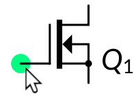

Using CSchem
============

CSchem has a deliberately sparse user interface that may take a little
getting used to. It is the author's hope, however, that users will
quickly get to appreciate the simplicity of the system.

Placing elements
----------------

To place an element with a predefined symbol, simply drag the symbol
from the sidebar onto the design:

To place custom elements, drag in
their SVG file from a “Filer” window [#f1]_. The “Caja” filer on my
Linux computer, automatically previews SVG files, which is very
helpful:

The pink circles in the SVG indicate connection points; those will be
hidden in CSchem, unless you hover over them, which turns them green:

Elements can be moved around simply by dragging the mouse. To delete
an element, simply hover over it and press “Delete.”

Placing connections
-------------------

Connections can be placed starting at pins of elements simply by
dragging the mouse. The connection will start in the direction of
initial motion, so drag away from the element to avoid tangles. Click
to fixate elbows in the connection; click on a pin of an element or on
another connection to complete the connection.

                   
Press “Return” to terminate a partially drawn connection and leave it
dangling. Press “Escape” or “Delete” to abandon a partially drawn
connection and remove it. To start drawing a new connection starting
from an existing connection, hold “Control” and hover over the old
connection. A transient marker will appear just as when you hover over
a pin, and you can drag out a new connection from that point.

Existing connections can be moved and reshaped simply by dragging the
mouse. While moving, connections will “snap” to nearby anchors such as
pins. This normally makes it easier to avoid spurious short
zigzags. When snapping gets in your way, simply hold “Control” to
disable it.

Sometimes, connections and up with several unnecessary elbows. To
simplify a connection, double click on a segment that you would like
to go away. This merges the segment with the nearest segment that runs
in the same direction, eliminating also the intermediate short segment
that runs in the perpendicular direction.

To delete a connection, simply hover over it and press “Delete.”  This
only deletes the highlighted segment, but “Control”+“B” deletes all
dangling connections, so it is easy to remove the rest.

Selections and copy and paste operations
----------------------------------------

Elements can be selected either by clicking on them or by dragging an
area around them. To add to an existing selection, hold “Shift” while
clicking or dragging. Connections cannot be explicity selected;
instead, connections between pairs of selected elements are implicitly
selected. Use “Control”+“C” to copy a selection to the clipboard or
“Control”+“X” to cut a selection to the clipboard. “Control”+“V”
pastes the contents of the clipboard to the mouse position and selects
what was pasted, so that it easy to fine position it. Normally, when
dragging a selection to a new location, junctions will be
automatically inserted as needed.

Adding text
-----------

Reference and part/value labels can be added to elements that don't
already display them by double clicking on the element. These labels
will move with the element and can be repositioned by dragging with
the mouse. To hide a label, hover over it with the mouse pointer and
press “Backspace.” (This doesn't actually delete the annotation; it
can be made visible again by double clicking the parent element.)

Arbitrary textual annotations can be placed anywhere on the canvas
simply by double clicking on the canvas. At present, custom
formatting is not supported, but your requests will be considered. To
remove an annotation, simply delete all the text in it. (Press
“Control”+“A” then “Backspace” or “Delete.”)

A few special tricks are automatically supported in text:

- Reference labels that comprise letters followed by numbers are
  automatically typeset with the letters in italic and the numbers as a
  subscript.

- In “part/value” labels, the word “Ohm” is automatically replaced
  with “Ω”, and “uF” and “uH” are automatically replaced with “µF” and
  “µH.”

- For resistors (technically: for elements that have a reference
  starting with “R”), a period at the end of the value label is also
  replaced with “Ω”.

- In arbitrary annotations, a few
  more automatic substitutions are made:

  - “>=”, “<=”, “!=”, “+-”, “<<”, “>>”, and “~~”
    become “≥”, “≤”, “≠”, “±”, “≪”, “≫”, and “≈”;
  - “uA” and “uV” become “µA” and “µV”;
  - reference names of existing elements are typeset as, e.g.,
    “*R*:sub:`1`.”

- Lastly, any part/value label that starts with a “V” or an “I” is
  typeset with the “V” or “I” as italic and the rest as a subscript,
  but only if the text is enclosed in literal double quotes. I
  sometimes use this to “name” connectors, as in this example:

  

Exporting and printing
----------------------

CSchem does not directly talk to printers. However, it can export the
circuit diagram as vector graphics (SVG). In addition, the parts list
can be exported as a CSV file. For further convenience, a bitmap image
of the diagram can be copied to the system clipboard for direct
inclusion in, e.g., an electronic lab notebook. Likewise, the parts
list can be copied to the system clipboard.

.. _fna:

Footnote
--------

.. [#f1] E.g., “Gnome Files” in Linux, the “Finder” in Mac OS, or the “File
         Explorer” in Windows.
